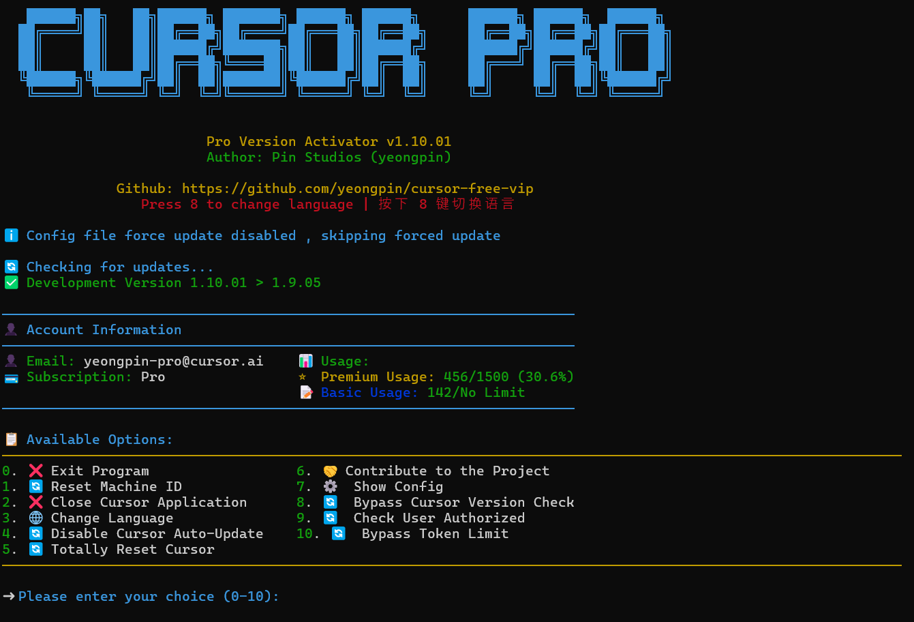

# ➤ Cursor Free VIP

<div align="center">
<p align="center">
  
</p>

<p align="center">

[](https://github.com/psipher/cursor-free-vip-main/releases/latest)
[](https://creativecommons.org/licenses/by-nc-nd/4.0/)
[](https://github.com/psipher/cursor-free-vip-main/releases/latest)

</p>

<br>

<h4>Support Latest 0.49.x Version</h4>

This tool is for educational purposes, currently the repo does not violate any laws. Please support the original project.

> [!NOTE]
> This project was originally forked from [cursor-free-vip](https://github.com/yeongpin/cursor-free-vip). Since the original repository is no longer receiving updates, I am maintaining this fork to ensure compatibility with the latest versions.
This tool registers accounts with custom emails, support Google and GitHub account registrations, temporary GitHub account registration, kills all Cursor's running processes, resets and wipes Cursor data and hardware info.
Supports Windows, macOS and Linux.

For optimal performance, run with privileges and always stay up to date.

<p align="center">
  <br>
</p>

</div>

## 🔄 Change Log

[Watch Change Log](CHANGELOG.md)

## ✨ Features

* Support Windows macOS and Linux systems
* Reset Cursor's configuration
* Multi-language support (English, 简体中文, 繁體中文, Vietnamese)

## 🚀 Recent Improvements

* **Enhanced Error Handling**: Robust error handling with detailed logging for better troubleshooting
* **Improved Configuration Management**: Centralized configuration with type validation and better defaults
* **Code Refactoring**: Better code organization with proper typing and documentation
* **Enhanced Process Management**: Better detection and management of Cursor processes across all platforms
* **Token Management**: Improved token validation, refresh, and extraction logic
* **Cross-Platform Compatibility**: Better handling of platform-specific paths and behaviors

## 💻 System Support

| Operating System | Architecture      | Supported |
|------------------|-------------------|-----------|
| Windows          | x64, x86          | ✅         |
| macOS            | Intel, Apple Silicon | ✅      |
| Linux            | x64, x86, ARM64   | ✅         |

## 👀 How to use

### 📦 Local Installation (Recommended)

<details open>
<summary><b>⭐ Step-by-step installation</b></summary>

#### **Windows**

```powershell
# 1. Clone or download the repository
cd "path\to\cursor-free-vip-main"

# 2. Create virtual environment
python -m venv myenv

# 3. Activate virtual environment
.\myenv\Scripts\activate

# 4. Install dependencies
pip install -r requirements.txt

# 5. Run with administrator privileges
# Option A: Use the batch file
.\run_as_admin.bat

# Option B: Manual PowerShell (as Administrator)
.\myenv\Scripts\python.exe main.py
```

#### **Linux/macOS**

```bash
# 1. Clone the repository
cd path/to/cursor-free-vip-main

# 2. Create virtual environment
python3 -m venv myenv

# 3. Activate virtual environment
source myenv/bin/activate

# 4. Install dependencies
pip install -r requirements.txt

# 5. Run the application
python main.py
```

</details>

<details>
<summary><b>⭐ Auto Run Script (Quick Install)</b></summary>

### **Linux/macOS**

```bash
curl -fsSL https://raw.githubusercontent.com/psipher/cursor-free-vip-main/main/scripts/install.sh -o install.sh && chmod +x install.sh && ./install.sh
```

### **Archlinux**

Install via [AUR](https://aur.archlinux.org/packages/cursor-free-vip-git)

```bash
yay -S cursor-free-vip-git
```

### **Windows**

```powershell
irm https://raw.githubusercontent.com/psipher/cursor-free-vip-main/main/scripts/install.ps1 | iex
```

</details>

If you want to stop the script, please press Ctrl+C

### 🔐 Administrator Privileges Required (Windows)

**Important**: This application requires Administrator privileges on Windows to function properly.

**Quick Start Options:**

1. **Using the launcher scripts** (Recommended):
   - Run `run_as_admin.bat` - Double-click and select "Run as administrator"
   - Or run `run_as_admin.ps1` - PowerShell script with auto-elevation

2. **Manual PowerShell Admin**:
   - Right-click Start button → Select "Terminal (Admin)" or "PowerShell (Admin)"
   - Navigate to project directory: `cd "path\to\cursor-free-vip-main"`
   - Run: `.\myenv\Scripts\python.exe main.py`

3. **Using built executable**:
   - The compiled `.exe` will automatically request admin privileges

**Why Admin Rights?**
- Registry modifications for machine ID reset
- System-level file access for Cursor configuration
- Complete hardware fingerprint changes

## ❗ Note

📝 Config File Path: `[Documents/.cursor-free-vip/config.ini]`
<details>
<summary><b>⭐ Configuration File</b></summary>

```
[Chrome]
# Default Google Chrome Path
chromepath = C:\Program Files\Google/Chrome/Application/chrome.exe

[Turnstile]
# Handle Turnstile Wait Time
handle_turnstile_time = 2
# Handle Turnstile Wait Random Time (must merge 1-3 or 1,3)
handle_turnstile_random_time = 1-3

[OSPaths]
# Storage Path
storage_path = /Users/username/Library/Application Support/Cursor/User/globalStorage/storage.json
# SQLite Path
sqlite_path = /Users/username/Library/Application Support/Cursor/User/globalStorage/state.vscdb
# Machine ID Path
machine_id_path = /Users/username/Library/Application Support/Cursor/machineId
# For Linux users: ~/.config/cursor/machineid

[Timing]
# Min Random Time
min_random_time = 0.1
# Max Random Time
max_random_time = 0.8
# Page Load Wait
page_load_wait = 0.1-0.8
# Input Wait
input_wait = 0.3-0.8
# Submit Wait
submit_wait = 0.5-1.5
# Verification Code Input
verification_code_input = 0.1-0.3
# Verification Success Wait
verification_success_wait = 2-3
# Verification Retry Wait
verification_retry_wait = 2-3
# Email Check Initial Wait
email_check_initial_wait = 4-6
# Email Refresh Wait
email_refresh_wait = 2-4
# Settings Page Load Wait
settings_page_load_wait = 1-2
# Failed Retry Time
failed_retry_time = 0.5-1
# Retry Interval
retry_interval = 8-12
# Max Timeout
max_timeout = 160

[Utils]
# Check Update
check_update = True
# Show Account Info
show_account_info = True

[TempMailPlus]
# Enable TempMailPlus (any email forwarded to TempMailPlus supports verification code retrieval, e.g. cloudflare email Catch-all)
enabled = false
# TempMailPlus Email
email = xxxxx@mailto.plus
# TempMailPlus pin
epin = 

[WindowsPaths]
storage_path = C:\Users\username\AppData\Roaming\Cursor\User\globalStorage\storage.json
sqlite_path = C:\Users\username\AppData\Roaming\Cursor\User\globalStorage\state.vscdb
machine_id_path = C:\Users\username\AppData\Roaming\Cursor\machineId
cursor_path = C:\Users\username\AppData\Local\Programs\Cursor\resources\app
updater_path = C:\Users\username\AppData\Local\cursor-updater
update_yml_path = C:\Users\username\AppData\Local\Programs\Cursor\resources\app-update.yml
product_json_path = C:\Users\username\AppData\Local\Programs\Cursor\resources\app\product.json

[Browser]
default_browser = opera
chrome_path = C:\Program Files\Google\Chrome\Application\chrome.exe
edge_path = C:\Program Files (x86)\Microsoft\Edge\Application\msedge.exe
firefox_path = C:\Program Files\Mozilla Firefox\firefox.exe
brave_path = C:\Program Files\BraveSoftware/Brave-Browser/Application/brave.exe
chrome_driver_path = D:\VisualCode\cursor-free-vip-new\drivers\chromedriver.exe
edge_driver_path = D:\VisualCode\cursor-free-vip-new\drivers\msedgedriver.exe
firefox_driver_path = D:\VisualCode\cursor-free-vip-new\drivers\geckodriver.exe
brave_driver_path = D:\VisualCode\cursor-free-vip-new\drivers\chromedriver.exe
opera_path = C:\Users\username\AppData\Local\Programs\Opera\opera.exe
opera_driver_path = D:\VisualCode\cursor-free-vip-new\drivers\chromedriver.exe

[OAuth]
show_selection_alert = False
timeout = 120
max_attempts = 3
```

</details>

* Use administrator privileges to run the script
* Confirm that Cursor is closed before running the script
* This tool is only for learning and research purposes
* Please comply with the relevant software usage terms when using this tool

## 🚨 Common Issues

| If you encounter permission issues, please ensure: | This script is run with administrator privileges |
|:--------------------------------------------------:|:------------------------------------------------:|
| Error 'User is not authorized' | This means your account was banned for using temporary (disposal) mail. Ensure using a non-temporary mail service |

## 🤩 Contribution

Welcome to submit Issues and Pull Requests!

<a href="https://github.com/psipher/cursor-free-vip-main/graphs/contributors">
  
</a>
<br /><br />

## 📩 Disclaimer

This tool is only for learning and research purposes, and any consequences arising from the use of this tool are borne by the user.

## ⭐ Star History

<div align="center">

[](https://star-history.com/#psipher/cursor-free-vip-main&Date)

</div>

## 📝 License

This project is licensed under [CC BY-NC-ND 4.0](https://creativecommons.org/licenses/by-nc-nd/4.0/).
Please refer to the [LICENSE](LICENSE.md) file for details.
